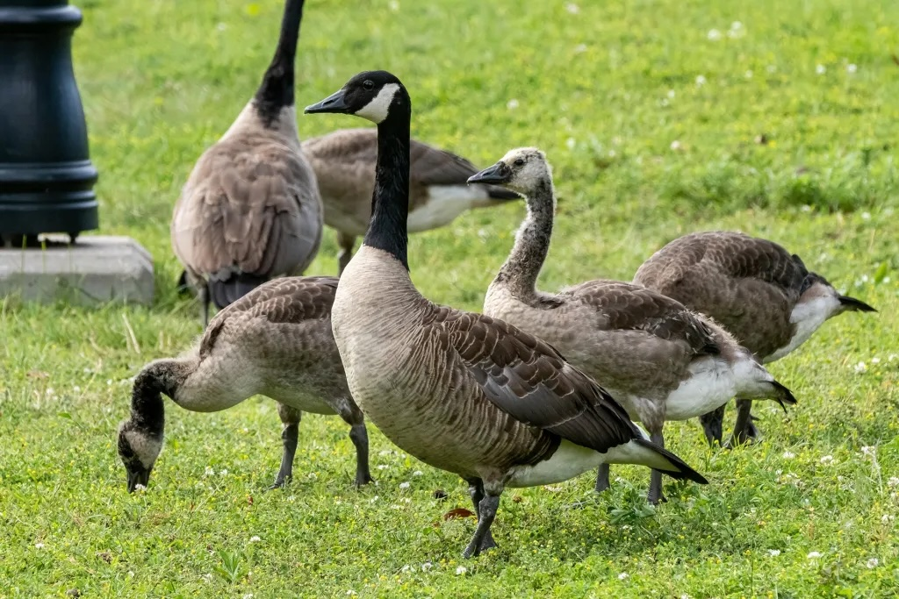

# unemploymentproject-geese

# 🪿 Geese Counter (Unemployment Project)

This is a lightweight geese detection and counting script using a custom-trained ONNX model. It can process both images and videos to detect geese and draw bounding boxes around them.

## 🧠 Tech Stack
- Python
- ONNX Runtime
- OpenCV

## 📸 Demo

### Input Image  

### Output Video  
📽️ [`output_video_counted6.mp4`](output_video_counted6.mp4)

