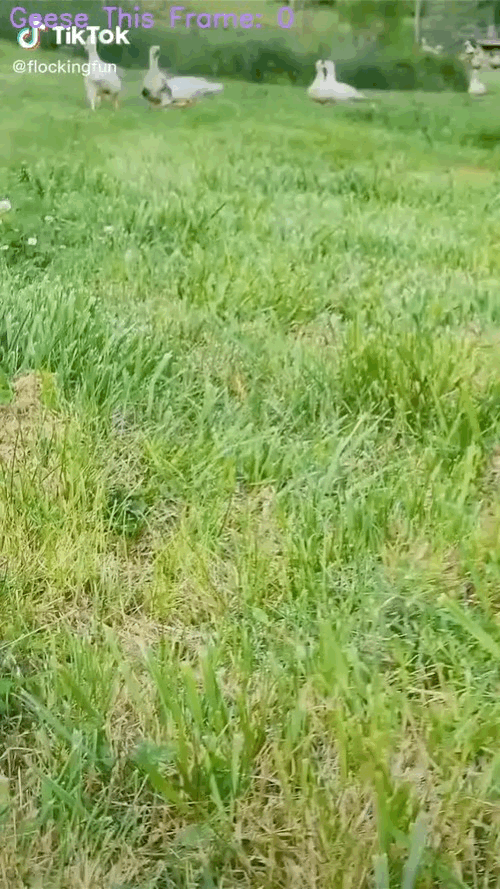

# 🪿 Geese Counter (Unemployment Project)

### Test Video Credit: flockingfun @TikTok
### Dataset Credit: https://universe.roboflow.com/geese-5amg6/geese-detection-v2/dataset/1

This is a lightweight geese detection and counting script using a custom-trained ONNX model. It can process both images and videos to detect geese and draw bounding boxes around them.

## 🧠 Tech Stack
- Python
- ONNX Runtime
- OpenCV

## 📸 Demo

### Input Image  

### Output Video (Preview)

